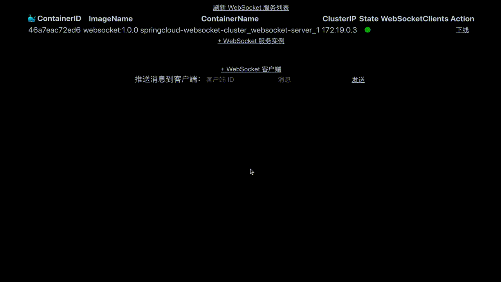

[](https://github.com/Lonor/websocket-cluster/actions/workflows/sonar.yml)
[](https://sonarcloud.io/dashboard?id=Lonor_websocket-cluster)
[](https://sonarcloud.io/dashboard?id=Lonor_websocket-cluster)
[](https://sonarcloud.io/dashboard?id=Lonor_websocket-cluster)

# 实战 Spring Cloud 的 WebSocket 集群

此项目是一个 WebSocket 集群的实践，基于 Spring Cloud。

[English Doc](./README-en.md)

## 原理

我们利用一致性哈希算法，构造一个哈希环，网关监听 WebSocket 服务实例的上下线消息，根据实例的变动动态地更新哈希环。 每次有新服务上线时，添加其对应的虚拟节点，将需要变动的 WebSocket
客户端重新连接到新的实例上，这样的代价是最小的；当然也取决与虚拟节点的数量以及哈希算法的公平性。服务下线时，实现相对容易——只需要将当前实例的所有客户端断开就行，客户端始终会重新连接的。
同时，哈希环的核心作用体现在负载均衡上。网关做请求转发时，会经过我们重写的自定义负载均衡过滤器，根据业务上需要哈希的字段来实现真实节点的路由。

## 技术栈

- Docker (开启 API 访问)
- Redis
- RabbitMQ
- Nacos

## 本地开发

为 [docker-compose.yml](./docker-compose.yml) 创建一个专用网络：

```shell
docker network create compose-network
```

本地构建，并使用 docker compose 简单编排部署：

```shell
mvn clean
mvn install -pl gateway -am -amd
mvn install -pl websocket -am -amd
docker build -t websocket:1.0.0 websocket/.
docker build -t gateway:1.0.0 gateway/.
docker-compose up -d
docker ps
```

可以用 `docker-compose scale websocket-server=3` 命令来创建新的 Websocket 实例。实际上我给这个项目写了一个前端来展示。

别忘了开启 Docker 的 API 访问，用 `docker -H tcp://0.0.0.0:2375 ps` 来验证 API 是否开启成功。 尝试开启：

### Linux 上开启 Docker API 访问

在 `docker.service` 文件中，将 `-H tcp://0.0.0.0:2375` 添加到 `ExecStart` 开头的那一行。

```shell
# cat /usr/lib/systemd/system/docker.service
ExecStart=...... -H tcp://0.0.0.0:2375
# after saved, restart the docker process
systemctl daemon-reload
systemctl restart docker
```

### macOS 上访问 Docker API

最佳实践是用 `alpine/socat` 来暴露 TCP 套接字。参考 [socat 的用法](https://github.com/alpine-docker/socat#example).

```shell
docker run -itd --name socat \
    -p 0.0.0.0:6666:2375 \
    -v /var/run/docker.sock:/var/run/docker.sock \
    alpine/socat \
    tcp-listen:2375,fork,reuseaddr unix-connect:/var/run/docker.sock
```

注意，Docker 的 macOS 客户端提供了一个 `docker.for.mac.host.internal` 的主机名，可以在容器内访问宿主网络。 我将这个地址用在了 `application.yml` 配置文件中，用来作为
redis、rabbitmq、nacos 服务端访问，因为他们都被我部署在容器里。如果要部署到服务器或自己本地开发，你可以把地址改掉。还有，我写了个 `Makefile`
用来帮自己在开发阶段更快地编译并重启服务，因为我并没有给这个项目配置一个持续集成流水线，请按需使用。

代码中，所有依赖注入都尽可能地在使用构造注入，并详细地打印了日志供分析。

## 前端

参见[此 React 项目](https://github.com/Lonor/websocket-cluster-front). 效果如图：



## 部署

修改 `docker-compose.yml`, 添加如下 host 解析，可以方便地替换掉服务调用地址而不用更改任何代码或 `application.yaml`，注意后面的 IP 建议使用服务器内网 IP 地址。唯一必要的修改是
Nacos 的 namespace.

```yml
 extra_hosts:
   - "docker.for.mac.host.internal:192.168.0.1"
```

所有必要环境就绪后，直接开启服务。请仔细参考 Makefile 中的内容使用，如：

```shell
make up
```

注意 `make down` 操作会删除所有 none 容器镜像以及 redis 中的内容。

## 贡献

若有帮助，欢迎 star 收藏。有问题请提交 Issue。贡献请 fork 此项目后提交 Pull Request.
